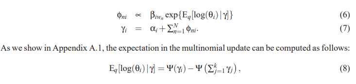
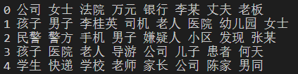
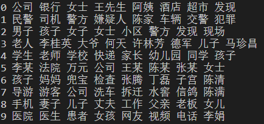
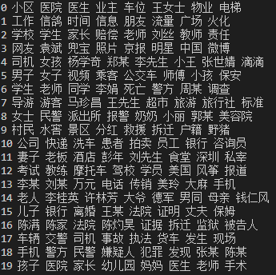

# LDA 

请使用python实现 Variational EM LDA。本次作业在 ./dataset 中提供了三种不同的数据集，dataset.txt 是英文的小规模数据集，dataset_cn.txt 是中文的中等规模数据集，dataset_cn_full.txt 是中文的大规模数据集。建议在较小数据集上验证实现正确性之后再使用较大的数据集。以下是作业要求：

* 根据提供的代码框架，写出 Variational EM LDA 的伪代码。  
  * Input:
    * X: a list of documents
    * K: the number of topics
    * V: the size of the vocabulary
    * D: the number of documents
    * vocab: a list of words in the vocabulary
  * Output:     
    * log_betas: V x K matrix of $log(\beta)$
    * gammas: D x K matrix of $\gamma$
    * alpha: initial hyperparameter for $p(\theta)$
    * bound: the variational bound
  1. Initialization：  
      initialize each topic with word counts from a subset of documents which  actually initializes phi_total.  
      compute the corresponding topics:  
      &emsp; log_betas = compute_log_betas_mle(phi_total)  
      &emsp; self.gammas = zeros(D, K)
  2. Iteration:  
      for epoch in epochs:  
      &emsp; for d in range(D):   
      &emsp; &emsp; bound, phi_d, gammas = update_parameters_for_one_item(counts_d)   
      &emsp; &emsp; update gammas, bound  
      &emsp; update log_betas, alpha   
      update_parameters_for_one_item(counts_d)  
      begin  
      &emsp;  for iter in iterations:  
      &emsp; &emsp;  for n in n_word_types:  
      &emsp; &emsp; &emsp;   update phi_d[n]   
      &emsp; &emsp; update gammas  
      &emsp; &emsp; compute bound  
      end
      

  3. End:  
    if (0 < delta < tolerance) or (epoch + 1) >= max_epochs:  
    &emsp; break  
    display n words in each topic


* 完成代码框架中缺失的变分推断部分。代码框架中已经实现了对于 $\alpha$, $\beta$ 的更新，只需要补充 main.py 的两个函数，计算ELBO并更新 $\gamma$, $\phi$。
  * $\gamma$, $\phi$ 更新策略：
    

* 设置主题个数 K 为 5,10,20，使用 dataset_cn_full.txt 数据集，针对不同的 K 显示每个 topic 中出现频率最高的8个单词。
  * K = 5  
    ```
    0 公司 女士 法院 万元 银行 李某 丈夫 老板
    1 孩子 男子 李桂英 司机 老人 医院 幼儿园 女士
    2 民警 警方 手机 男子 嫌疑人 小区 发现 张某
    3 孩子 医院 老人 导游 公司 儿子 患者 何天
    4 学生 快递 学校 老师 家长 公司 陈家 男同
    ```
  * K = 10  
    ```
    0 公司 银行 女士 王先生 阿姨 酒店 超市 发现
    1 民警 司机 警方 嫌疑人 陈家 车辆 交警 犯罪
    2 男子 孩子 女子 女士 小区 警方 发现 现场
    3 老人 李桂英 大爷 何天 许林芳 德军 儿子 马珍昌
    4 学生 老师 学校 快递 家长 幼儿园 同学 孩子
    5 李某 法院 万元 公司 王某 陈某 张某 女士
    6 孩子 妈妈 兜宝 检查 张腾 丁磊 子宫 陈清
    7 导游 游客 公司 洗车 拆迁 水窖 信鸽 陈满
    8 手机 妻子 儿子 丈夫 工作 父亲 老板 女儿
    9 医院 医生 患者 女孩 网友 视频 电话 李娟
    ```
  * K = 20  
    ```
    0 小区 医院 医生 业主 车位 王女士 物业 电梯
    1 工作 信鸽 时间 信息 朋友 流量 广场 火化
    2 学校 学生 家长 赔偿 老师 刘丝 教师 责任
    3 网友 袁斌 兜宝 照片 京报 明星 中国 微博
    4 司机 女孩 杨学奇 郑某 李先生 小王 张世婧 滴滴
    5 男子 女子 视频 乘客 公交车 师傅 小孩 保安
    6 学生 老师 同学 李娟 死亡 警方 周某 调查
    7 导游 游客 马珍昌 王先生 超市 旅游 旅行社 标准
    8 女士 民警 派出所 报警 奶奶 小丽 郭某 美容院
    9 村民 水窖 景区 分红 救援 拆迁 户籍 野猪
    10 公司 快递 洗车 患者 拍卖 员工 银行 咨询员
    11 妻子 老板 酒店 彭年 刘先生 食堂 深圳 私宰
    12 考试 教练 摩托车 驾校 学员 美国 风筝 报道
    13 李某 刘某 万元 电话 传销 美玲 大麻 手机
    14 老人 李桂英 许林芳 大爷 德军 男同 母亲 钱仁风
    15 儿子 银行 离婚 王某 法院 证明 丈夫 保姆
    16 陈满 陈家 法院 陈灼昊 证据 拆迁 监狱 被告人
    17 车辆 交警 司机 事故 执法 货车 发生 现场
    18 手机 警方 民警 嫌疑人 犯罪 发现 张某 陈某
    19 孩子 医院 家长 幼儿园 妈妈 医生 老师 手术
    ```    

* 观察结果，找到主题分类效果最好的K，并分析原因。
  * K = 5  
    

  * K = 10  
    

  * K = 20  
    

  其中，K = 10 时，主题分类效果最好，可能是因为数据集中的文本涉及了多个领域和话题，如果 K 太小，会导致主题过于宽泛和混杂；如果 K 太大，会导致主题过于细化和冗余。而 K = 10 可以比较合理地划分出这些领域和话题，使得每个主题都有明显的特征词和区分度。