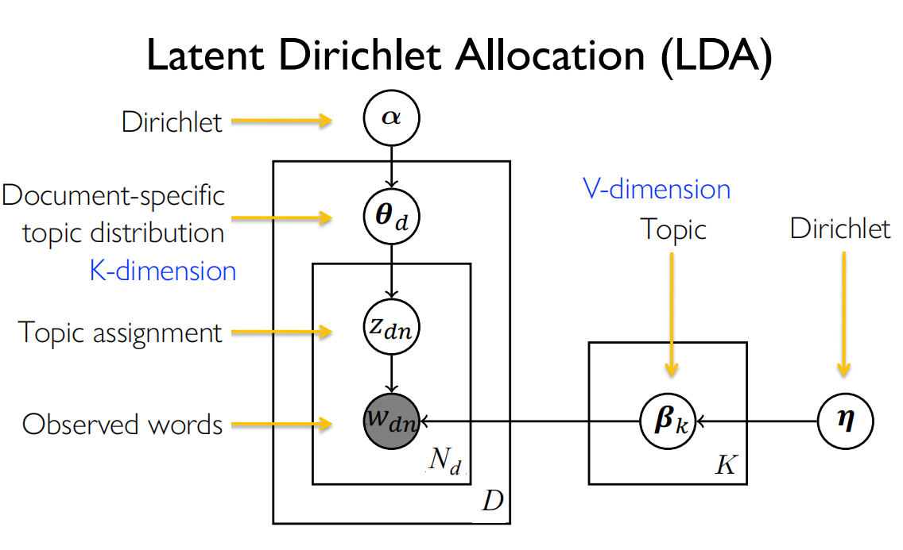

# LDA 

请使用python实现 Variational EM LDA。本次作业在 ./dataset 中提供了三种不同的数据集，dataset.txt 是英文的小规模数据集，dataset_cn.txt 是中文的中等规模数据集，dataset_cn_full.txt 是中文的大规模数据集。建议在较小数据集上验证实现正确性之后再使用较大的数据集。以下是作业要求：

* 根据提供的代码框架，写出Variational EM LDA的伪代码。

* 完成代码框架中缺失的变分推断部分。代码框架中已经实现了对于α, β的更新，只需要补充main.py的两个函数，计算ELBO并更新γ, ϕ。

* 设置主题个数K为5,10,20，使用 dataset_cn_full.txt 数据集，针对不同的 K 显示每个 topic 中出现频率最高的8个单词。

* 观察结果，找到主题分类效果最好的K，并分析原因。

补充说明：
1. 本次代码框架中使用了 scipy，log(gamma(x)) 是 gammaln 函数，log(gamma(x)) 的
导数是 psi 函数。
1. 本次代码框架没有引入λ，在变分推断更新 γ 和 ψ 时可能与课件有所出
入，同学们可以参考原论文中的这一更新过程。
1. 考虑到时间问题，对于大规模数据集 dataset_cn_full.txt，最大更新轮次
（max epochs）设置为 10 轮即可